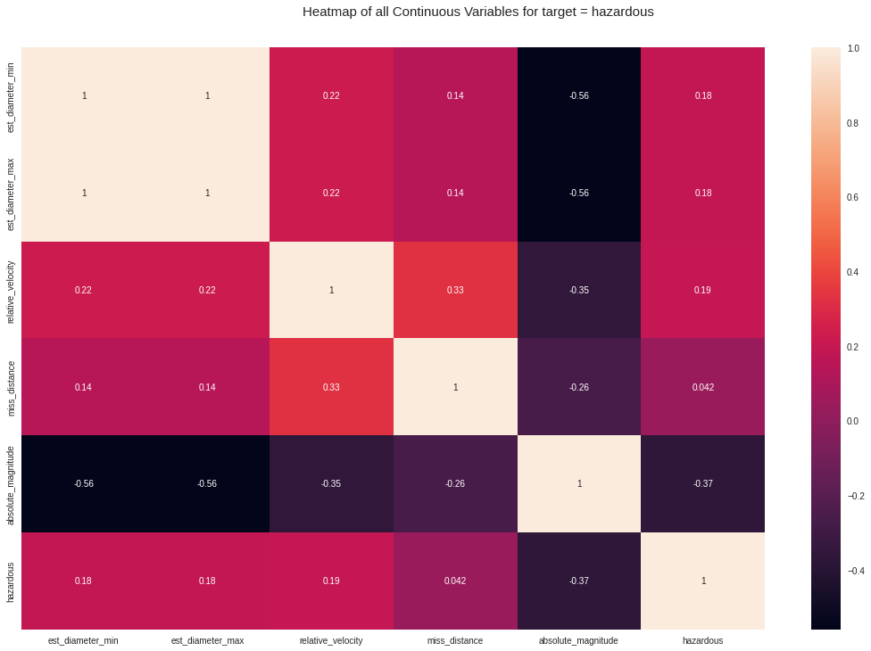

Predict the Collision and Save the Earth
==============================


## Predict the Collision from the Nearest Object around this World and Save the Earth.
From the NASA's official data, this project is developed for doing the prediction. Top 10 machine learning model is used to make the prediction with evaluation metrics such as Accuracy, Precision, Recall, F1-Score. And the data visualization is one of the core part of this project. 

Project Organization
------------

    ├── LICENSE
    ├── Makefile           <- Makefile with commands like `make data` or `make train`
    ├── README.md          <- The top-level README for developers using this project.
    ├── data
    │   ├── external       <- Data from third party sources.
    │   ├── interim        <- Intermediate data that has been transformed.
    │   ├── processed      <- The final, canonical data sets for modeling.
    │   └── raw            <- The original, immutable data dump.
    │
    ├── docs               <- A default Sphinx project; see sphinx-doc.org for details
    │
    ├── models             <- Trained and serialized models, model predictions, or model summaries
    │
    ├── notebooks          <- Jupyter notebooks. Naming convention is a number (for ordering),
    │                         the creator's initials, and a short `-` delimited description, e.g.
    │                         `1.0-jqp-initial-data-exploration`.
    │
    ├── references         <- Data dictionaries, manuals, and all other explanatory materials.
    │
    ├── reports            <- Generated analysis as HTML, PDF, LaTeX, etc.
    │   └── figures        <- Generated graphics and figures to be used in reporting
    │
    ├── requirements.txt   <- The requirements file for reproducing the analysis environment, e.g.
    │                         generated with `pip freeze > requirements.txt`
    │
    ├── setup.py           <- makes project pip installable (pip install -e .) so src can be imported
    ├── src                <- Source code for use in this project.
    │   ├── __init__.py    <- Makes src a Python module
    │   │
    │   ├── data           <- Scripts to download or generate data
    │   │   └── make_dataset.py
    │   │
    │   ├── features       <- Scripts to turn raw data into features for modeling
    │   │   └── build_features.py
    │   │
    │   ├── models         <- Scripts to train models and then use trained models to make
    │   │   │                 predictions
    │   │   ├── predict_model.py
    │   │   └── train_model.py
    │   │
    │   └── visualization  <- Scripts to create exploratory and results oriented visualizations
    │       └── visualize.py
    │
    └── tox.ini            <- tox file with settings for running tox; see tox.readthedocs.io


--------


##  Requirements
- matplotlib == 3.5.1
- numpy == 1.22.2
- pandas == 1.4.1
- scikit-learn == 1.1.1
- scikit-plot == 0.3.7
- seaborn == 0.11.2
- tensorflow == 2.8.0
- xgboost == 1.6.1
- autoviz == 0.1.42
- sklearn == 0.0

All the packages can be installed from requirements.txt using the following code-
```sh
pip install -r requirements.txt
```

## About the Dataset
The official dataset is from NASA's official website https://cneos.jpl.nasa.gov/ca/ . And the modified version of this dataset is available on Kaggle. Link : https://www.kaggle.com/datasets/sameepvani/nasa-nearest-earth-objects
## Overview
- The whole implemented program can be found at notebook folder.
- Used models can be found in models folder.
- Visualization and evaluation reports can be found in reports -> figures folder.
- Dataset can be found in src -> data folder.
- Main driver program can be found at src -> model folder.

The models are used in this project,
- Adaboost Classifier
- Logistic Regression
- Multi-Layer Perceptron
- Stochastic Gradient Descent
- XGBoost Classifier
- Linear Perceptron Classifier
- Support Vector Classification
- Gradient Boosting Classifier
- K-Nearest Neighbors
- Random Forest Classifier
## Steps to Follow
For the notebook,
- open the prediction.ipynb in jupyter notebook from notebooks folder.
- Goto section 3 and change the csv path according to your download path.
- run all.

For the main program,
- Open the __init__.py from src -> model folder.
- change the dataset directory according to the path.
- run the program.
For this program, a user input is required.

| Model Name | User input |
| ------ | ------ |
| Adaboost Classifier | 1 |
| Logistic Regression | 2 |
| Multi-Layer Perceptron | 3 |
| Stochastic Gradient Descent | 4 |
| XGBoost Classifier | 5 |
| Linear Perceptron Classifier | 6 |
| Support Vector Classification | 7 |
| Gradient Boosting Classifier | 8 |
| K-Nearest Neighbors | 9 |
| Random Forest Classifier | 10 |

## Notes
- All the dataset visualization performed using Autoviz
- All the evaluation score performed using confusion matrix and yellowbrick classification report

## Snaps



## License
[](https://github.com/tterb/atomic-design-ui/blob/master/LICENSEs) 


<p><small>Project based on the <a target="_blank" href="https://drivendata.github.io/cookiecutter-data-science/">cookiecutter data science project template</a>. #cookiecutterdatascience</small></p>
